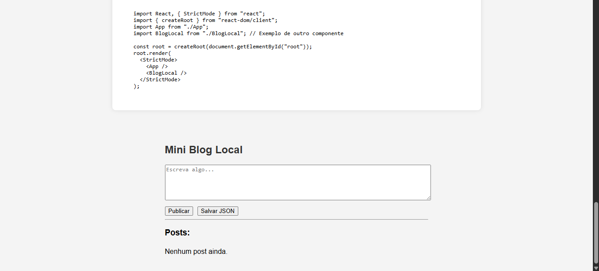
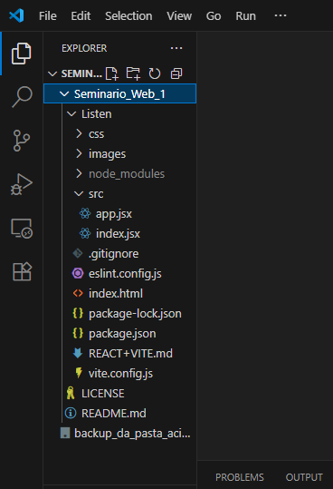

# Seminario_1-Web_1
Neste projeto será desenvolvido uma página que lide com a inserção de múltiplos dados e o carregamento deles. Será uma única página com um espaço para um seção de comentários e respostas entre o autor e os leitores da página. O projeto está em rascunho, o banco de dados será necessário para que o Blog seja realmente funcional e dinâmico.

# Autores
- Luigi Aranha
- Giovana
- Emily
- Ray

## Avisos
- Para funcionar será necessário inserir este comando no terminal bash e responder a três perguntas:
     
    - npm create vite@latest
    
    - ◇  Project name:
    Listen
    
    - ◇  Package name:
    package
    
    - ◇  Select a framework:
    React
    
    - ◇  Select a variant:
    JavaScript
    
    - ◇  Scaffolding project in /workspaces/Seminario_1-Web_1/Listen...
    
    - Done. Now run:

- Insira este três comandos em sequência
    - cd Listen
    - npm install
    - npm run dev

    - O seu projeto está pronto agora crie arquivos em seu devido lugar em sua nova pasta, neste caso "Listen"

    - Site para justificar a necessidade de baixar essa ferramenta: ** https://react.dev/learn/build-a-react-app-from-scratch **

    - Uma vez feito os passos a passos acima bastará agora usar este dois comandos:
    
    - cd Listen (ou outro nome escolhido anteriormente ao nomear o projeto. É necessário entrar neste diretório ao pressionar enter para o "npm run dev" funcionar.)

        - npm run dev
        - (Digite "o" e pressione "enter", assim abrirá uma página ativa)

- Informação
    - Para que o "npm run dev" funcione ao inserir no terminal bash, entre primeiro o comando "cd Listen" para depois inserir o "npm run dev" e insira "o" + "enter" para abrir uma página ativa 

- Caso seja executado localmente no computador:
    - Instale o Node.js (https://nodejs.org/)
    - Instale as dependências do projeto com (usando o terminal Git Bash):
        - npm install
        - Instale o Vite localmente (se não estiver nas dependências):
        - npm install vite --save-dev

## Desenvolvimento e Codificação
- Primeiramente escrevemos uma página simples com o próprio html e css padrão
- Ao finalizar inseriu-se a referência de um arquivo .jsx a ser carregado nela, nesse caso: ""
- No "index.jsx estruramos como seria a renderização dessa página e importamos os itens (vindos de "app.jsx") e bibliotecas necessárias
- No "index.jsx" foi importado as seguintes bibliotecas: 
    - import { StrictMode } from "react";
    - import { createRoot } from "react-dom client";
    - import "../css/styles.css";
    - import { BlogLocal } from "./app";

    - Além de declarado e preenchido uma variável que irá inserir o root no final do "index.html"
        - const root = createRoot(document.getElementById("root"));

        - root.render( <StrictMode> <BlogLocal><BlogLocal> </StrictMode> ); //Coloquei este código em uma única linha.
    
    - O "index.jsx" está pronto, será necessário criar as funções no app.jsx e exportá-las para que o "index.jsx" possa usá-las e renderizá-las no final da página

    - O "app.jsx" importará somente: import { useState, useEffect } from 'react'; // Sempre ao importar, coloque todas as importações no cabeçalho do arquivo

    - Com isso foi feito um código usando somente essa biblioteca e os recurso padrão fornecidos pelo React

    - Se tudo foi feito corretamnete a sua página será renderizada junto do React implementado nela

        - Dessa forma aqui: 

        - Informação sobre a estrutura das pastas: 

## Bibliografia
- https://www.javaguides.net/2020/09/react-router-step-by-step-tutorial.html

- https://youtu.be/NhUr8cwDiiM?si=fCe3Os8jNjlj46cr

- Auxílio de IAs (como ChatGPT e entre outras)